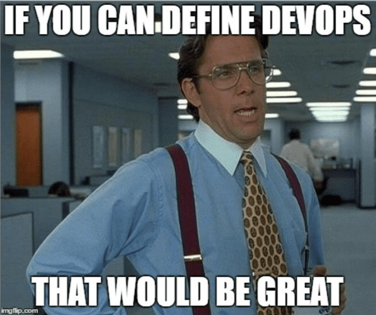
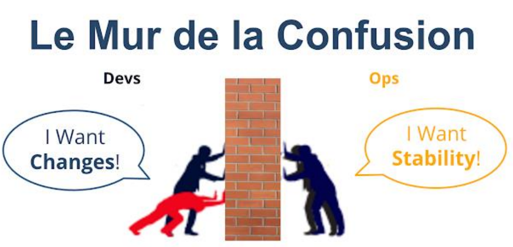
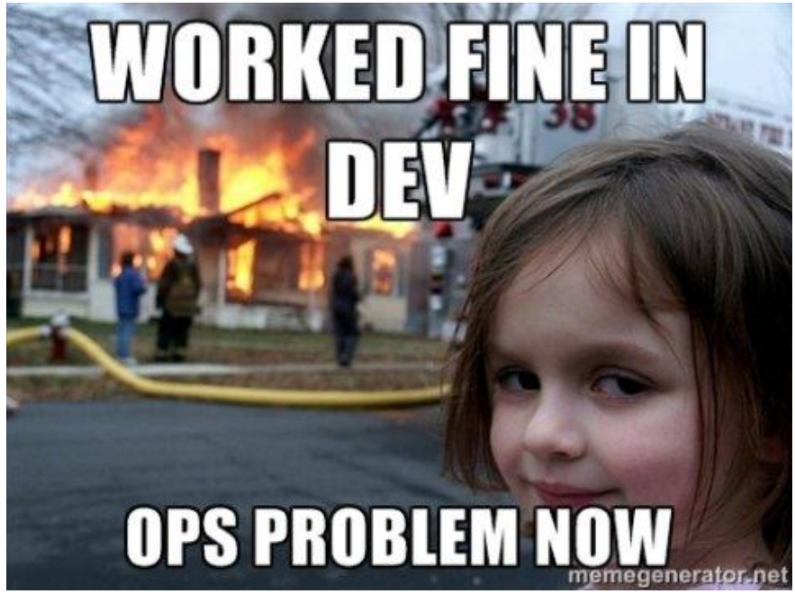
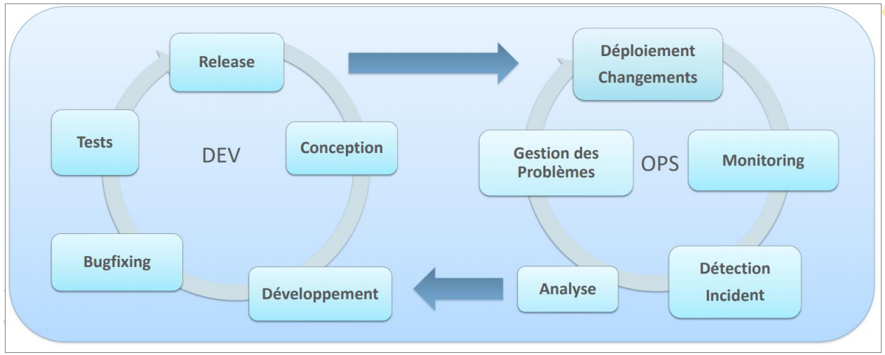
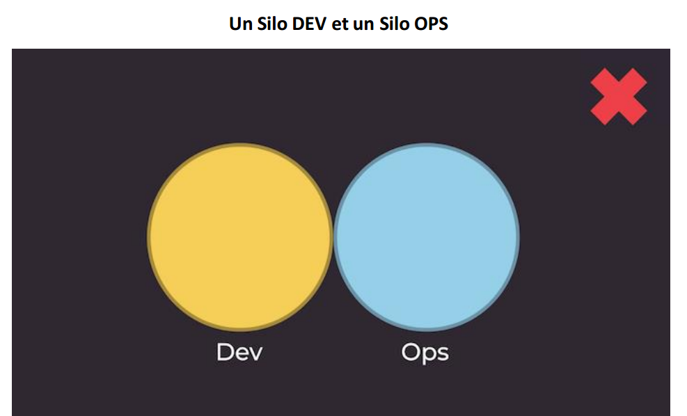
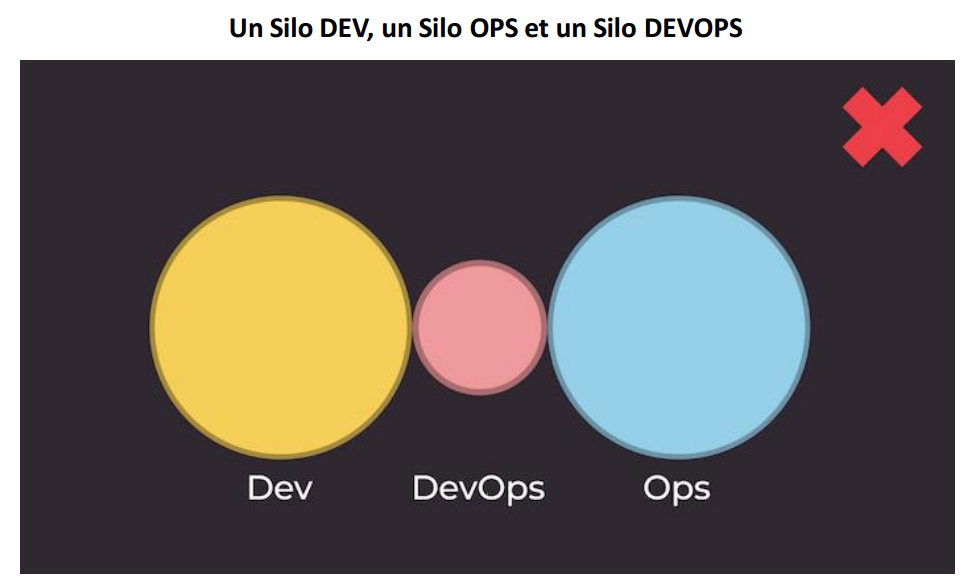
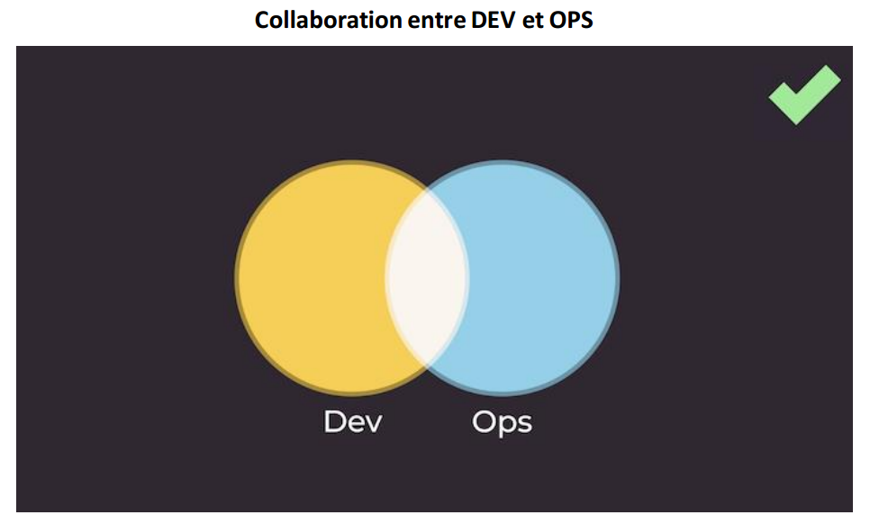
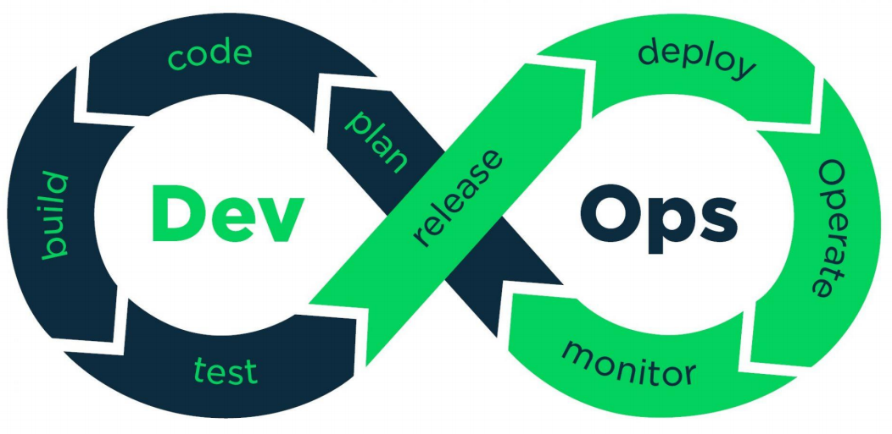
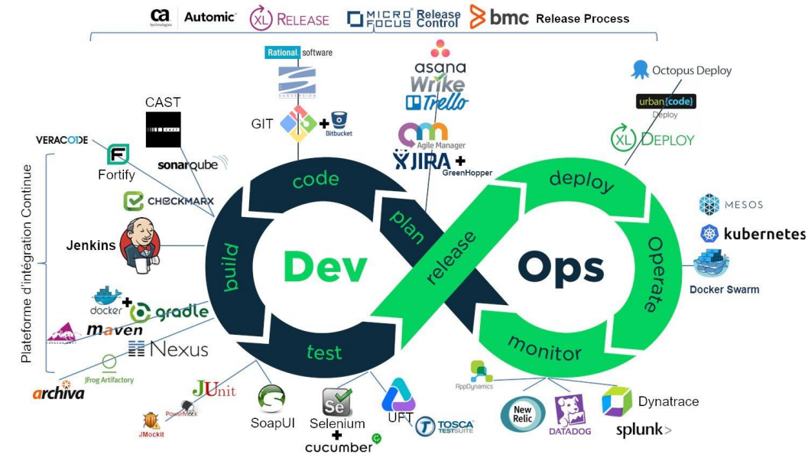

# Introduction au DevOps:

**Qu'est-ce que le DevOps:** Ne pas se laisser embrouiller par l’usage abusif du terme dans des contextes parfois farfelus.  

**DevOps** est un ensemble de **pratiques** qui met l’accent sur la **collaboration** et la **communication** entre les **développeurs** de logiciels **DEV** et les professionnels des **opérations** informatiques **OPS**.

*Un peu d'historique : le terme DevOps a été utilisé pour la première fois
par **Patrick Debois et Andrew Shafer** dans leur conférence **Agile infrastructure**,
lors de la **2008 Agile Toronto conference***.  

Il faut savoir que l'informatique d'entreprise a **siloté** les aspects **dev** et **ops** des applications, en plaçant les responsabilités respectives dans des équipes séparées. Il s'est alors créé ce qu'on appelle **le mur de la confusion**. Ce mur est apparu car les **deux équipes** ont des objectifs respectifs **antagonistes**.

* La première, l'équipe de développement **DEV**, a pour objectif principal de **faire évoluer l'application**, en **ajoutant de nouvelles fonctionnalités** ou en **corrigeant des bugs**, le plus **rapidement** possible et cela, dans un délai et un **coût moindres** ***Time-To-Market***, souvent au détriment de la qualité quand les contraintes de planning arrivent.  

* La seconde équipe, l'équipe des opération **OPS**, a comme objectif de **maintenir l'application** en conditions opérationnelles, en garantissant la **stabilité** de l'application et la qualité de cette dernière, en sacrifiant souvent le coût et le temps nécessaires au déploiement d'une nouvelle version.

Le **DevOps** est un ensemble de **bonnes pratiques** qui met l'emphase sur l'**automatisation** des processus entre les équipes de développement, et les équipes en charge du maintien en conditions opérationnelles de l'application développée.  

Ces pratiques permettent alors de développer, **tester** et **livrer** des applications plus **rapidement** et avec plus de **fiabilité**.  

Quelques avantages apportés par le DevOps:  

* Gain de **collaboration** et de **confiance** des équipes entre elles
* Livrez plus rapidement et travaillez plus **intelligemment**
* Réduisez le **délai** de résolution
* Gérez plus efficacement les tâches **non planifiées**

**Deux Cycles de vie différents:**

Les piliers du DevOps:
Le DevOps est souvent associé à l'acronyme **CALMS** désignant les 5 piliers de cette méthodologie, qui 
sont :
* Culture ;
* Automatisation ;
* Lean ;
* Mesure ;
* Share.
**CALMS** est un framework qui évalue la capacité d'une entreprise à adopter les processus DevOps et qui permet de mesurer la réussite lors d'une transformation DevOps.

* **Culture:**  
DevOps n'est pas simplement un processus, ou une approche différente  du développement, c'est un **virage culturel**. La **collaboration** est un élément essentiel de la **culture DevOps**.

***DevOps ne résout pas les problèmes d'outils. Il résout les problèmes humains.***  

Pour favoriser la **collaboration**, la meilleure façon consiste à partager un **objectif commun** et à établir un plan pour l'**atteindre ensemble**.

* **Automatisation:**
L'automatisation permet d'éliminer **les tâches manuelles *épétitives**, exploite 
des processus reproductibles et crée des systèmes fiables.  

* **Lean:**
Le lean est un terme anglais qui signifie **Legé** ou **maigre**. Le lean est une idéalisation de la gestion de la production avec comme principe fondamental la gestion sans gaspillage.

* **Mesure:**
Il existe une multitude d'outils sur le marché pour **juger de la performance** d'une application, ou d'une transformation.  
Les différents indicateurs utilisés peuvent être :
* **Combien de temps** la nouvelle fonctionnalité a pris pour **passer du développement à la production** ?
* Combien de fois un **bug récurrent** apparaît ?
* Combien de **personnes utilisent le produit** en temps réel ?
* Combien d'utilisateurs a-t-on **gagnés ou perdus** en une semaine ?

Ces indicateurs sont aussi utiles en entreprise, afin de pouvoir **challenger** les métiers sur la **priorisation du backlog**. Elles ont encore plus d'impact lorsqu'elles sont **partagées** avec **d'autres équipes**, en particulier celles **d'autres services**.  

* **Partage:**
Le fameux **mur de la confusion** est largement dû à un manque de savoir commun.   

L'un des grands principes **DevOps** est que le **développeur** d'une app doit également participer à sa **livraison** et à son **exécution**. Cela ne veut pas dire que chaque **développeur** doit être un **exploitant excellent** ! Mais que les **opérations** et les **développeurs** doivent travailler de concert sur le **cycle de vie complet** de l'application.

* **Résumé:**
Autant nous souhaiterions disposer d'une baguette magique pour transformer toutes les équipes en équipes DevOps ultra performantes, autant les **transformations DevOps** nécessitent un **mélange de pratiques**, de **philosophies culturelles** et **d'outils**.  

Adopter **DevOps** n'est pas une mince affaire. Pourtant, avec la **mentalité**, les **efforts** et les **outils appropriés**, une organisation peut opérer une transformation **DevOps** pour en tirer des **avantages significatifs**.

## Les défis du DevOps:

Commençons par les **anti-patterns**, car ils découlent généralement d'une bonne idée au départ, qui se transforme au fur et à mesure en une **idée contre-productive** allant à l'encontre de ce qu'elle est censée améliorer.

Le premier **anti-pattern** que l'on retrouve souvent en entreprise, ce que le **DevOps** cherche à éliminer, est la **séparation** entre les équipes de **développement** et les équipes **d'opérationnel**. Ces équipes sont séparées par le fameux **mur de la confusion**.  
Une des bonnes idées qu'une entreprise peut avoir, afin de pallier la problématique citée 
précédemment, est de **mettre en place une équipe DevOps** en charge de l'implémentation des **processus de livraison et de déploiement**. Cette équipe est généralement transverse à l'entreprise et est sollicitée par toutes les applications, afin de pouvoir mettre en place des outils d'automatisation.

Malheureusement, la création de cette équipe transverse génère **un troisième silo**, car elle va être confrontée à :
* des devs sollicitant, mais ne comprenant pas les fondamentaux du DevOps ;
*  des ops qui veulent garder la main sur la mise en production, garder leurs outils, et ne voient généralement pas d'un bon œil la création de cette équipe.  

De plus, les devs et les ops consommateurs de cette équipe ne comprenaient pas les 
fondamentaux du DevOps, et se reposaient alors quasiment exclusivement sur cette équipe transverse.   
Nous avions alors créé **un troisième silo**, alors que le **DevOps** est **censé les casser les silos et fluidifier la communication**.  

Si cette équipe n'avait été là que **temporairement**, et avait **éduqué les développeurs et les ops** afin qu'ils soient **autonomes pour le déploiement et la livraison continus**, alors cela aurait été un des bons patterns à appliquer.  
 
  

La clé pour la réussite de l'implémentation du DevOps au sein d'une entreprise est 
la communication entre les développeurs et les ops.  

Résumons ensemble les bonnes et mauvaises pratiques.  

* **Mauvaises pratiques :**
    * silo Dev et silo Ops. Aucune méthodologie DevOps
    * silo DevOps. LE piège, créer un troisième silo en essayant de briser les deux autres ; 

* **Bonnes pratiques:**
    * Collaboration entre dev et ops. La collaboration est la clé pour un bon fonctionnement
    * Equipe DevOps temporaire. Une équipe DevOps qui n'est présente que le temps de mettre en place les démarches DevOps et former les équipes Dev et Ops aux bonnes pratiques ;

## Les outils du DevOps:

Outre Le **virage culturel** qui réunit les **DEV** et les **OPS**, **DevOps** est une pratique qui s'accompagne de nouveaux principes de gestion et des **outils technologiques** qui aident à implémenter les bonnes pratiques.  

Quand il est question de chaîne **d'outils DevOps**, les organisations doivent rechercher des outils qui améliorent la **collaboration**, **réduisent les changements de contexte**, introduisent **l'automatisation**, et tirent parti de **l'observabilité** et de la **surveillance** pour livrer plus rapidement de meilleurs logiciels.  

Il existe deux types principaux de chaîne d'outils DevOps : **tout-en-un** ou **ouverte**.
* Une chaîne d'outils DevOps **tout-en-un** fournit une solution complète qui ne s'intègre généralement pas à d'autres outils tiers.
* Une chaîne d'outils **ouverte** peut être personnalisée en fonction des besoins d'une équipe à l'aide de différents outils.  

un processus DevOps doit exploiter les bons outils pour gérer les phases clés du cycle de vie DevOps:  
* Planifier
* Build
* Infrastructure-as-Code
* Contrôle de version et programmation collaborative
* Intégration et déploiement continus
* Surveillance
* Agir
* Feedback continu

* **Planifier:**
Pour commencer, il vous faut un bon outil de planification pour permettre aux équipes 
de développement et opérationnelles de répartir le travail en tâches plus petites et faciles à gérer pour accélérer les déploiements.
* Des outils qui permettent de planifier un sprint, de suivre les tickets et de collaborer, comme **Jira**.
* Des outils qui permettent à la connaissance et la collaboration de se rejoindre, 
comme **Confluence**.
* Des outils qui facilitent la communication et augment la productivité, comme **Slack**.

* **Code:**
Toute société de développement qui se respecte dispose d'un outil de gestion du code source. Cet outil permet non seulement de conserver le code source, mais de gérer aussi les différentes versions et branches du code. Sur le marché, il existe 2 générations d'outils.

* La première est centralisée : le code est stocké à un endroit et éventuellement répliqué, mais seule la base centrale fait foi. Ce qui peut être contraignant pour des équipes réparties géographiquement.

* La seconde génération est décentralisée. Les répliques se synchronisent automatiquement. Parmi les secondes générations d'outils, décentralisés, citons : **Git** (l'outil) ou **GitHub** (le service) ; Outre le fait d'être décentralisé, **Git** gère plus facilement les différentes branches de codes et les fusions.

* **Build:**
On appelle aussi la phase de **Build** phase **d'intégration** car c'est à ce moment que le code de chaque développeur est assemblé pour donner le produit final. Techniquement, on compile, on réalise l'édition et on package le tout pour que l'exécutable puisse être déployé dans les différents environnements, y compris de production.
La phase de **build** permet aussi de garantir des environnements de développement identiques à la production. **Jenkins** est l'un des outils les plus populaires.

* **Test:**
L'étape la plus importante dans la vie d'un logiciel est **la phase de tests**.
La qualité du code est directement corrélée avec le nombre de tests.
**Les tests d'intégration système** : permettent de tester l'application intégrée dans son écosystème.  
**Les Tests fonctionnels:** permettent de valider les fonctions de l'application.  
**Les tests de non-régression:** permettent de vérifier que les évolutions introduites dans la nouvelle version ne font pas dysfonctionner les précédentes fonctions livrées.  
Comme exemple d'outil de test, on peut citer **Selenium**.

* **Release:**
Quand votre logiciel a passé les **tests d'intégration**, il peut généralement être mis à disposition des testeurs. Tant qu'il était en phase de développement, on ne parlait que de **build**. Dès qu'il est jugé suffisamment stable pour être mis en **recette**, on parle de **release**.  
Évidemment, avant qu'un produit ne soit mis en **production**, un certain nombre de versions applicatives va se succéder en recette pour aboutir à une **release**.
Pour gérer ces **différentes releases**, il faut un outil de gestion qui permet de stocker mais aussi d'organiser et distribuer les logiciels et leurs bibliothèques, avec la bonne version. **Nexus** est un outil de gestion de **release**.

* **Deploy:**
Une fois votre **produit testé** et mis à disposition dans le référentiel de composants, il faut le **déployer** dans les différents environnements d'**intégration**, de **recette**, de **pré-production** et de **production**, sans parler de ceux de maintenance et de formation.
Tout cela de manière **automatisée** si possible. Dans le plus simple des cas, il vous faut un outil qui sache déployer votre produit sur les différents environnements existants comme **XLDEPLOY**. Dans les cas les plus complexes, il faut aussi provisionner ces environnements, et ce de manière automatisée bien sûr.

* **Operate**
Nous abordons enfin pour terminer le sujet le plus vaste, celui des Ops. Il s'agit de maintenir en condition opérationnelle l'infrastructure et les applications qui tournent dessus.Il est trop vaste.   
Mais s'il est un sujet qu'on ne peut éviter en parlant du DevOps, c'est bien celui des **conteneurs** (containers).  
Le conteneur facilite grandement la vie des **Dev et des Ops**. Car le conteneur embarque toutes les **dépendances applicatives**. Le code, les éventuels runtime, les outils système, toutes les bibliothèques nécessaires et le paramétrage de l'application. Il suffit donc de construire son application dans son conteneur pour être capable de la déployer et de la faire tourner dans n'importe quel environnement, pourvu que celui-ci dispose d'un gestionnaire de conteneurs type **Docker**.

* **Monitor:**
La **supervision** est un sous-ensemble d'Operate. C'est sans doute un des principaux 
piliers des **Ops** avec la sauvegarde des données. Il n'y a donc rien de neuf dans le 
concept. Mais comme je l'ai dit précédemment, la mesure fait partie intégrante 
de la culture DevOps. Il est donc essentiel pour les **devs** comme pour les **ops**
d'avoir des **indicateurs sur le comportement de l'application**. **Dynatrace** est un outil de supervision largement utilisé.

