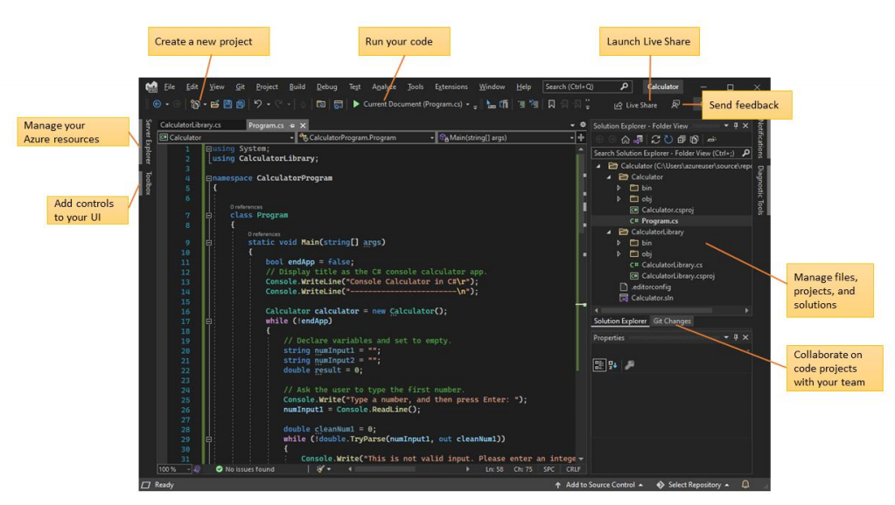

# Introduction aux environnements de développement intégrés - EDI (IDE in English):

Un environnement de développement intégré (EDI), est un logiciel regroupant un ensemble d’outils 
nécessaires au développement logiciel dans un (ou plusieurs) langage(s) de programmation.  
Outils inclus au minimum dans un EDI :  

* un éditeur de texte spécialisé (avec coloration syntaxique, indentation automatique …)
* un compilateur (ou au moins l’intégration d’un compilateur existant),
* un débogueur (ou au moins l’intégration d’un débogueur existant),
* des outils d’automatisation de la compilation et de gestion de projets.

Outils également présents :
* un système de gestion de versions (ou l’intégration avec un système existant comme GIT),
* des outils de conception d’interface graphique ,
* un navigateur de classes (pour explorer la hiérarchie des classes),
* des outils de tests unitaires (vérification systématique du code)
* des outils de maintenance/remaniement du code (refactoring en anglais),
* un générateur de documentation (ou l’intégration avec un système existant comme Javadoc )

## Les EDI d'aujourd'hui:

*PYPL (PopularitY of Programming Language Index)** publié chaque mois son classement des langages 
de programmation en fonction de leur popularité. Mais le baromètre le fait également pour les 
environnements de développement ;

Le classement de **PYPL** prend en compte aussi bien les **simples éditeurs de code** que les 
**environnements de développement évolués**. Pour le mois de décembre 2024, Visual Studio, Visual Studio code et Eclipse sont 
en tête de l'indice de popularité PYPL des EDI de bureau.  

**L'EDI Open Source Eclipse** détient aujourd'hui **10% de parts de marché**. **Visual Studio et Visual Studio code de Microsoft avec 43% de parts de marché**. Tous les deux, ils ne sont donc pas loin de s’approprier la **moitié des parts de marché**, loin devant **Android Studio de Google** à la troisième place avec **9% de parts de marché**.

## EDI Visual Studio Code - VSC:

Visual Studio Code est un IDE, léger et complet, qui prend en charge une multitude d’extensions pour toutes sortes de développeurs. Voici les caractéristiques clés de Visual Studio Code :
* Légèreté
* Multiplateforme
* Coloration syntaxique
* Débogueur intégré
* Terminal intégré
* Prise en charge Git intégrée
* IntelliSense avec autocomplétion
* Open source
* Extensible

### Installation de Visual Studio Code:

1. Téléchargez localement visual studio code https://code.visualstudio.com/
2. Installez le binaire.

Une fois l'installation terminée. Quand vous exécutez Visual Studio Code pour la première fois, vous 
devez voir une page d’accueil similaire à celle de la capture d’écran ci-dessous. Si vous ne voyez 
pas la page d’accueil, vous pouvez y accéder à l’aide du menu déroulant **Aide > Accueil**.

### Installation des extensions VSCODE:

Dans l’interface utilisateur de Visual Studio Code, la barre d’activités se trouve sur la gauche. Si vous 
ne voyez pas la barre d’activités, vous pouvez l’afficher en suivant la procédure ci￾dessous : Affichage > Apparence > Afficher la barre d’activités. L’icône Extensions est mise en 
surbrillance dans l’image suivante.

  

Puisque c’est la première fois que vous installez des extensions, vous verrez la liste des extensions 
les plus populaires sur la Place de marché.

Pour procéder à l’installation, il vous suffit de cliquer sur le bouton Installersitué à côté d’une 
extension dans la Place de marché.À présent, nous allons en installer quelques-unes
* Material Theme
* Prettier Now
* Bracket Pair Colorizer
* Live Server
* Markdown
* Git Extension
* Python

## Conculusion:

Voici ce que vous avez appris dans ce module :
* Les principales fonctionnalités de Visual Studio Code
* Comment télécharger et installer Visual Studio Code
* Comment installer les extensions pour le développement web de base
Ce module ne constitue qu’une introduction. Vous pouvez passer à d’autres modules pour découvrir les nombreuses autres fonctionnalités. Pour obtenir des informations détaillées sur chacune des fonctionnalités Visual Studio Code, consultez https://code.visualstudio.com/docs.