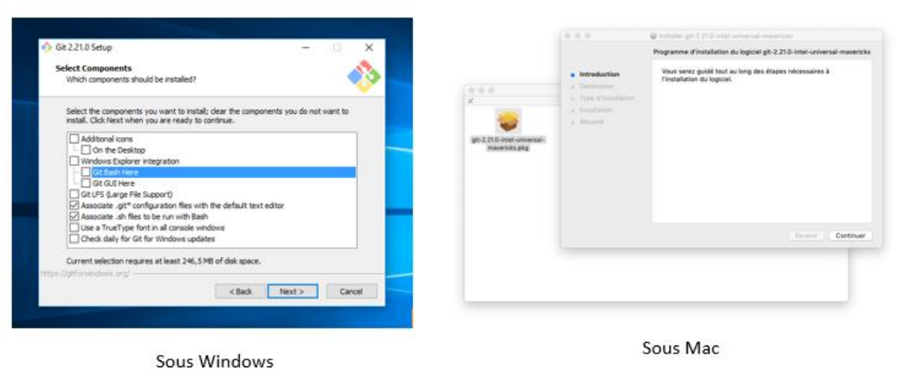
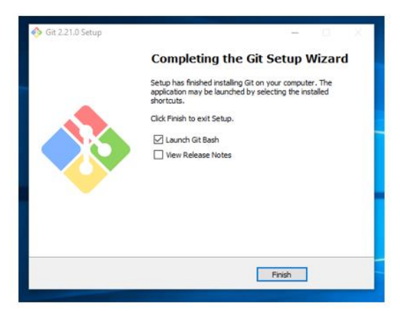
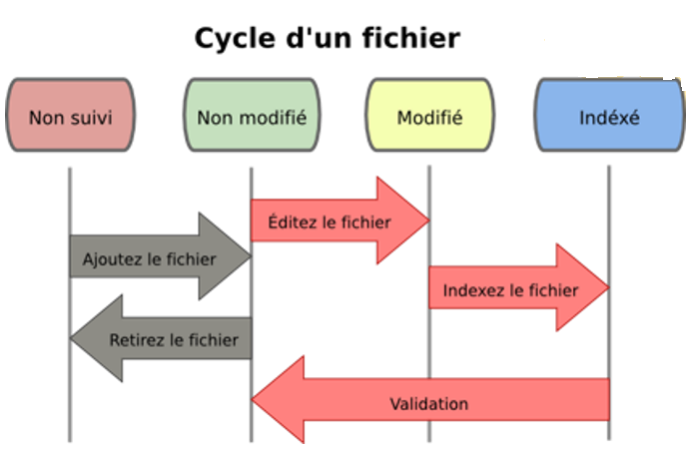

# Introduction à Git:

Git est un système de gestion de versions distribuée **(VCS: Vesion Control System)** créé par **Linus Torvalds**, également connu pour la création et la maintenance du **noyau Linux**. 
Un système de gestion de versions est un système de suivi des modifications de code pour les développeurs. Les avantages du système de gestion de versions **Git** sont les suivants:
* Il sépare les environnements de test en branches
* Il offre la possibilité de naviguer vers un commit particulier sans supprimer l’historique
* Il offre la capacité à gérer les commits de différentes manières, y compris en les combinant
* Et comporte diverses autres fonctionnalités, voir ici ***https://git-scm.com/about/branching-and-merging***  

Git s’articule autour de plusieurs commandes principales:   

* **Repository (Référentiel de données)**: la structure des données de votre code, y compris un 
dossier .git dans le répertoire racine
* **Commit (Validé)**: un état enregistré particulier du référentiel, cela inclut tous les fichiers et ajouts
* **Branch (Branche)**: un moyen de séparer les différents Commits, ayant une histoire unique. Ceci est principalement utilisé pour séparer le développement et les branches stables.
* **Push (Pousser)**: mettez à jour le référentiel distant avec vos modifications locales
* **Pull (Tirer)**: mettez à jour votre référentiel local avec les modifications à distance
* **Clone (Cloner)**: récupération d’une copie locale d’un référentiel pour fins de le modifier
* **Fork (Fourche)**: duplication d’un référentiel préexistant à modifier et à comparer avec l’original
* **Merge (Fusion)**: combinant divers changements de différentes branches / validations / fourchettes en un seul historique

### Le Référentiel de données 'Repository':  

Un référentiel Git est une structure de données contenant la structure, l’historique et les fichiers d’un projet.  
Les référentiels Git comprennent généralement:

* Un dossier .git. Ce dossier contient les différentes informations sur le référentiel.
* Un fichier .gitignore. Ce fichier contient les fichiers ou répertoires que vous ne voulez pas inclure lors de la 
validation.
* Fichiers et dossiers. Il s’agit du contenu principal du référentiel.

**Création du Référentiel de données:**  
Vous pouvez stocker le repertoire localement ou dans un serveur distant. Ce serveur distant étant le **cloud**, ou peut-être un autre support de stockage qui héberge votre repertoire.   
**GitHub** est un service d’hébergement gratuit populaire. De nombreux développeurs l’utilisent, et c’est ce que nous utiliserons plus tard dans le cours.


## Installation de Git:

Avant de commencer à utiliser Git, il faut qu’il soit disponible sur votre ordinateur. Même s’il est déjà installé, c’est probablement une bonne idée d’utiliser la dernière version disponible.  

* **Installation sur Windows:**  
L’application officielle est disponible au téléchargement sur le site web de Git. Rendez-vous sur http://git-scm.com/download/win et le téléchargement démarrera automatiquement. Notez que c’est un projet nommé Git for Windows.  

* **Installation sur macOS:**
La plus facile est probablement d’installer les Xcode Command Line Tools. Sur Mavericks (10.9) ou postérieur, vous pouvez simplement essayer de lancer git dans le terminal la première fois. Rendez-vous sur http://git-scm.com/download/mac.  

Une fois le binaire téléchargé, appuyez sur Suivant à chaque fenêtre puis surInstaller. Lors de l’installation, laissez toutes les options par défaut, elles conviennent bien.  



Si vous êtes sous Windows : cochez ensuite Launch Git Bash. Pour les utilisateurs de Mac ou Linux, 
votre terminal suffira amplement. Git Bash est l’interface permettant d’utiliser Git en ligne de 
commande.



Git Bash se lance sur windows. Pour Mac et Linux, il suffit de lancer un terminal


Pour travailler sur Git, vous devez créer un dépôt local, c'est-à-dire un dossier dans lequel toutes vos modifications seront enregistrées. C’est ce qu’on appelle **initialiser un dépôt Git**.  

### Configurez votre identité:
La première chose à faire est de configurer votre identité. Pour cela, vous allez entrer dans le monde des lignes de commande !  
Commencez par renseigner votre nom et votre adresse **e-mail**. C'est une information importante car vous en aurez besoin pour toutes vos validations dans Git.  

Par la suite on activera les couleurs afin d’améliorer la lisibilité des différentes branches. Et en fin nous configurons un éditeur de text. Git utilise **Vim** comme éditeur et **Vimdiff** comme outil de merge.

Ouvrez git bash ou un ternimal (Exemple terminal vscode):

``
git config --global user.name "John Doe"
git config --global user.email johndoe@example.com
```

Créez un répertoire projet:

```
mkdir my-project
cd my-project
git init
```

Le dossier **my-project** reste vide après initialisation. Un dossier caché .git a été créé!  
Vous pouvez l'afficher en allant dans Affichage => Éléments masqués.
Pour les plus curieux d’entre vous, sachez que ce dossier caché contient tous les éléments non visibles de Git : la configuration, les “logs”, les branches...
* **En résumé:**
    * Pour installer Git, vous devez télécharger et configurer Git sur votre ordinateur.
    * Pour initialiser un dépôt Git, vous pouvez soit créer un dépôt local vide
    * git init permet d’initialiser un projet Git.

### Mon premier Commit:



Quatre états d’un projet Git:  
* **Non suivi**: fichier n’étant (n’appartenant) pas ou plus géré par Git;
* **Non modifié**: fichier sauvegardé de manière sûre dans sa version courante dans la base de données du 
dépôt;
* **Modifié**: fichier ayant subi des modifications depuis la dernière fois qu’il a été soumis;
* **Indexé**: idem pour modifié, sauf qu’il sera pris instantané dans sa version courante de la prochaine 
soumission (**commit**).

Sur votre terminal ou git Bash, positinnez vous sur dans le répertoire **my-project**.

* Vérifier l'état des fichiers de votre dépôt

```
git status
```