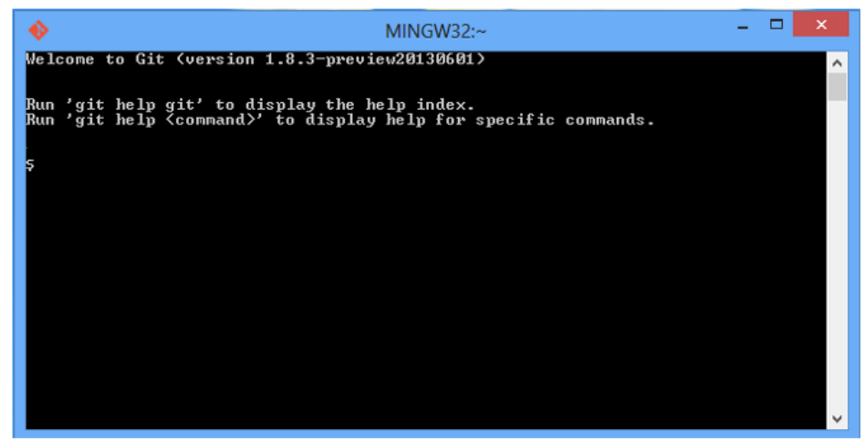

# Introduction à Git:

Git est un système de gestion de versions distribuée **(VCS: Vesion Control System)** créé par **Linus Torvalds**, également connu pour la création et la maintenance du **noyau Linux**. 
Un système de gestion de versions est un système de suivi des modifications de code pour les développeurs. Les avantages du système de gestion de versions **Git** sont les suivants:
* Il sépare les environnements de test en branches
* Il offre la possibilité de naviguer vers un commit particulier sans supprimer l’historique
* Il offre la capacité à gérer les commits de différentes manières, y compris en les combinant
* Et comporte diverses autres fonctionnalités, voir ici ***https://git-scm.com/about/branching-and-merging***  

Git s’articule autour de plusieurs commandes principales:   

* **Repository (Référentiel de données)**: la structure des données de votre code, y compris un 
dossier .git dans le répertoire racine
* **Commit (Validé)**: un état enregistré particulier du référentiel, cela inclut tous les fichiers et ajouts
* **Branch (Branche)**: un moyen de séparer les différents Commits, ayant une histoire unique. Ceci est principalement utilisé pour séparer le développement et les branches stables.
* **Push (Pousser)**: mettez à jour le référentiel distant avec vos modifications locales
* **Pull (Tirer)**: mettez à jour votre référentiel local avec les modifications à distance
* **Clone (Cloner)**: récupération d’une copie locale d’un référentiel pour fins de le modifier
* **Fork (Fourche)**: duplication d’un référentiel préexistant à modifier et à comparer avec l’original
* **Merge (Fusion)**: combinant divers changements de différentes branches / validations / fourchettes en un seul historique

### Le Référentiel de données 'Repository':  

Un référentiel Git est une structure de données contenant la structure, l’historique et les fichiers d’un projet.  
Les référentiels Git comprennent généralement:

* Un dossier .git. Ce dossier contient les différentes informations sur le référentiel.
* Un fichier .gitignore. Ce fichier contient les fichiers ou répertoires que vous ne voulez pas inclure lors de la 
validation.
* Fichiers et dossiers. Il s’agit du contenu principal du référentiel.

**Création du Référentiel de données:**  
Vous pouvez stocker le repertoire localement ou dans un serveur distant. Ce serveur distant étant le **cloud**, ou peut-être un autre support de stockage qui héberge votre repertoire.   
**GitHub** est un service d’hébergement gratuit populaire. De nombreux développeurs l’utilisent, et c’est ce que nous utiliserons plus tard dans le cours.


## Installation de Git:

Avant de commencer à utiliser Git, il faut qu’il soit disponible sur votre ordinateur. Même s’il est déjà installé, c’est probablement une bonne idée d’utiliser la dernière version disponible.  

* **Installation sur Windows:**  
L’application officielle est disponible au téléchargement sur le site web de Git. Rendez-vous sur http://git-scm.com/download/win et le téléchargement démarrera automatiquement. Notez que c’est un projet nommé Git for Windows.  

* **Installation sur macOS:**
La plus facile est probablement d’installer les Xcode Command Line Tools. Sur Mavericks (10.9) ou postérieur, vous pouvez simplement essayer de lancer git dans le terminal la première fois. Rendez-vous sur http://git-scm.com/download/mac.  

Une fois le binaire téléchargé, appuyez sur Suivant à chaque fenêtre puis surInstaller. Lors de l’installation, laissez toutes les options par défaut, elles conviennent bien.  


Si vous êtes sous Windows : cochez ensuite Launch Git Bash. Pour les utilisateurs de Mac ou Linux, 
votre terminal suffira amplement. Git Bash est l’interface permettant d’utiliser Git en ligne de 
commande.


Git Bash se lance sur windows. Pour Mac et Linux, il suffit de lancer un terminal



Pour travailler sur Git, vous devez créer un dépôt local, c'est-à-dire un dossier dans lequel toutes vos modifications seront enregistrées. C’est ce qu’on appelle **initialiser un dépôt Git**.  

### Configurez votre identité:

La première chose à faire est de configurer votre identité. Pour cela, vous allez entrer dans le monde des lignes de commande !  
Commencez par renseigner votre nom et votre adresse **e-mail**. C'est une information importante car vous en aurez besoin pour toutes vos validations dans Git.  

Par la suite on activera les couleurs afin d’améliorer la lisibilité des différentes branches. Et en fin nous configurons un éditeur de text. Git utilise **Vim** comme éditeur et **Vimdiff** comme outil de merge.

* Ouvrez git bash ou un ternimal (Exemple terminal vscode):

```
git config --global user.name "John Doe"
git config --global user.email johndoe@example.com
```

* Créez un répertoire projet:

```
mkdir my-project
cd my-project
git init
```

Le dossier **my-project** reste vide après initialisation. Un dossier caché .git a été créé!  
Vous pouvez l'afficher en allant dans Affichage => Éléments masqués.
Pour les plus curieux d’entre vous, sachez que ce dossier caché contient tous les éléments non visibles de Git : la configuration, les “logs”, les branches...
* **En résumé:**
    * Pour installer Git, vous devez télécharger et configurer Git sur votre ordinateur.
    * Pour initialiser un dépôt Git, vous pouvez soit créer un dépôt local vide
    * git init permet d’initialiser un projet Git.

### Mon premier Commit:


Quatre états d’un projet Git:  
* **Non suivi**: fichier n’étant (n’appartenant) pas ou plus géré par Git;
* **Non modifié**: fichier sauvegardé de manière sûre dans sa version courante dans la base de données du 
dépôt;
* **Modifié**: fichier ayant subi des modifications depuis la dernière fois qu’il a été soumis;
* **Indexé**: idem pour modifié, sauf qu’il sera pris instantané dans sa version courante de la prochaine 
soumission (**commit**).

Sur votre terminal ou git Bash, positinnez vous sur dans le répertoire **my-project**.

* Vérifier l'état des fichiers de votre dépôt

```
git status
```


Téléchargez les deux fichier ci-dessous et copiez les dans le répertoire **my-project**
* hello.html [here](https://github.com/atifrani/mgt_opl_env_dev/blob/main/webapp/hello.html)
* style.css  [here](https://github.com/atifrani/mgt_opl_env_dev/blob/main/webapp/style.css)

* Vérifier l'état des fichiers de votre dépôt

```
git status
```


Pour indéxer les modifications (Ajouts de fichiers), on utilise la commade git add <fichiers>. Cela permet d'enregistrer 
les modifications qu'on souhaite ajouter à notre dépôt.  


```
git add hello.html
git add style.css
```

```
git status
```


Pour ajouter les modifications (les deux fichiers) au dépôt git, je vais utiliser la commande **git commit -m "comments"**
L'option –m permet d'ajouter un message pour comprendre ce que apporte votre commit.


```
git commit -m "mon premier commit"
```

```
git status
```


* Nous allons maintenant modifier le fichier hello.html.
* À la ligne 15, modifier la balaise <div> comme ceci <div id="top-banner">
Cela va permettre de charger le style graphique id="top-banner" que se trouve dans le fichier style.css.
* Ouvrez le fichier hello.html dans un navigateur pour visualiser la modification
* Retournez sur le terminal et exécuter les commandes suivantes:

```
git status
git add hello.html
git status
```


Pour annuler votre dernier git add, utilisez cette commande:  

```
git reset
git status
```


Ajoutez les modifications a votre dépôt en exécutant les commandes suivantes:  

```
git add hello.html
git commit -m "ajout d'une banner"
git status
```

Pour lister les modifications apportées au fichier hello.html, on utilise la commande git diff  
La commande permet d'afficher les modifications par rapport à la version précédente.  

```
git diff hello.html
```


Modifiez le fichier hello.html en ajoute une section pour vous décrire en une ligne comme ceci.


Une fois les modifications terminées, réalisez le workflow de base pour enregistrer les modifications 
dans votre dépôt git.

```
git status
git add hello.html
git commit -m "ajout d'une description"
git status
```

Après avoir créé plusieurs **commits** en passant par la zone d'indexage.  
Les différents **commits** sont enregistrés dans **l'historique de votre dépôt git**.    
Dans la prochaine section nous allons nous intéresser à **l'historique du dépôt git**.  
vous souhaitez probablement revoir le fil des évènements de votre projet et **revenir en arrière** à une **version antérieur** de voter projet. C'est justement ce que nous allons découvrir dans la prochaine section.  

### L'historique d'un dépôt Git:

**L'historique d'un dépôt git** est constitué d'un ensemble de **commits** reliés entre eux par un **pointeur**.  
Un ensemble de **commits** reliés entre eux constitue une **branche**, la **branche par défaut** se nomme la brache **master ou main** qui est **la branche principale** de notre projet.  

Un commit est constitué d'un ensemble d'informations:  


Pour afficher l'historique des commits on utilise la commande **git log**.  
On peut réduire le nombre de commits affichés en utilisant le commande **git log –n 1**.  

```
git log
git log -n 1
```


Pour afficher les modifications d'un commit, on utiliser la commande **git show <sha-1>**  

```
git show dc33a4a08d9417689216552dbff5a5836afc955a  # modifiez le sha-1 par le votre.
```

Pour revenir à une version antérieure de votre projet il suffit de se déplacer sur le **commit** de la version à laquelle vous souhaitez revenir. Pour cela on utiliser la commande **git checkout <sha-1>**.  
Vérifiez le code **hello.html** et la page web pour constater si cela à macher.

```
git checkout dc33a4a08d9417689216552dbff5a5836afc955a  # modifiez le sha-1 par le votre.
```

```
git log
```

Pour revenir à la dernière version de votre projet, il suffit d'utiliser la commande git checkout sur le 
dernier commit de votre projet ou sur la branch de votre projet.  

```
git checkout master
```

```
git log
```

Que se passe-t-il vraiment quand on navigue dans l'historique d'un dépôt git.  


Git utilise deux tags par défaut **Master** et **HEAD**  
* **Master** pointe sur le dernier commit
* **HEAD** pointe sur le commit se lequel on est positionné

### Utilisation des tags:

Git donne la possibilité d’étiqueter **TAG** un certain état dans l’historique comme important.   
Généralement, les gens utilisent cette fonctionnalité pour marquer les états de publication (Versions). Pour lister la liste des tags on utilise la commande **git tag**.

Nous allons créer un tag pour chaque commit de notre projet. Pour cela, il faut naviguer dans l'historique pour revenir vers une version antérieure du projet avec la commande git checkout et  puis créer un tag pour cette version en utilisant la commande git tag.


```
git checkout dc33a4a08d9417689216552dbff5a5836afc955a  # modifiez le sha-1 par le votre.

git tag version1 -m "version 1 de la webapp"
```

```
git checkout master  

git tag version2 -m "version 2 de la webapp"
```

Une fois terminé, vérifiez que vous avez bien un tag par version de votre projet

```
git tag
```

Maintenant, vous pouvez utiliser les tags pour naviguer dans l'historique de votre dépôt git en utilisant la commande 
**git checkout tag**.  

```
git checkout version1
git log
```

```
git checkout version2
git log
```
## Exercice:

* Assurez-vous que vous êtes sur la dernière version de votre projet en utilisant la commande **git checkout master**.
* Ouvrez le fichier hello.html avec votre IDE et ajoutez les modifications suivantes:


* Ajoutez les modifications à votre dépôt git
* Créez un nouveau tag nommer version4

## Utilisation des Branches:

La branche principale **(main ou master)** portera l’intégralité des modifications effectuées. Le but n’est donc pas de réaliser les modifications directement sur cette branche, mais de les réaliser sur d’autres branches, et après divers tests, de les intégrer sur la branche principale.  

Il faut voir les branches comme autant de dossiers différents. Prenons un exemple concret.

Imaginez que vous ayez réalisé une superbe application web pour M. Robert, et que ce dernier ait une superbe idée de fonctionnalité à ajouter à son application.  

Panique à bord dans votre tête ! Votre application fonctionne parfaitement, elle est en production, et y toucher serait prendre le risque de tout faire planter.  

Avec Git et ses fameuses branches, pas de soucis. Vous pouvez créer une branche correspondant à l’évolution “fonction”, et cela **sans toucher à votre application en cours de production.** 

Une fois que toutes vos modifications auront été testées, vous pourrez les envoyer en production sans crainte en les intégrant à la branche main.  


Pour connaître les branches présentes dans notre projet, il faut taper la ligne de commande :  

```
git branch
```
Dans un premier temps, vous n’aurez que la branch **main**.  

Nous avons donc notre branche main, et nous souhaitons maintenant réaliser la fonctionnalité diplomes. Pour cela, on tape :

```
git branch diplomes
```

Cette commande va créer la **branche diplomes** en local.  

Vous pouvez de nouveau taper la ligne de commande :

```
git branch
```

Pour basculer de branche, nous allons utiliser :  

```
git checkout diplomes
```

Nous allons réaliser l'evolution de notre application web en ajoutant la fonctionnalité diplomes.  
Copier coller cette section dans vote fichier hello.html

```
<h1> Mes diplomes </h1>
<p> Master MIAGE Informatique Decisonnel </p>
```

Une fois les modifications terminées, réalisez le workflow de base pour enregistrer les modifications 
dans votre dépôt git.  

```
git status
git add hello.html
git commit -m "ajout de la fonctionnalité diplomes"
git status
```

Une fois la fonctionnalité est validée, vous pouvez fusionner la branch **diplomes** avec la branch **main**.

```
git checkout main
git merge diplomes
git tag version 4 -m "version 4 de la webapp"
```

Vous pouvez par la suite supprimer votre branch **diplomes**.  

```
git branch -d diplomes
```