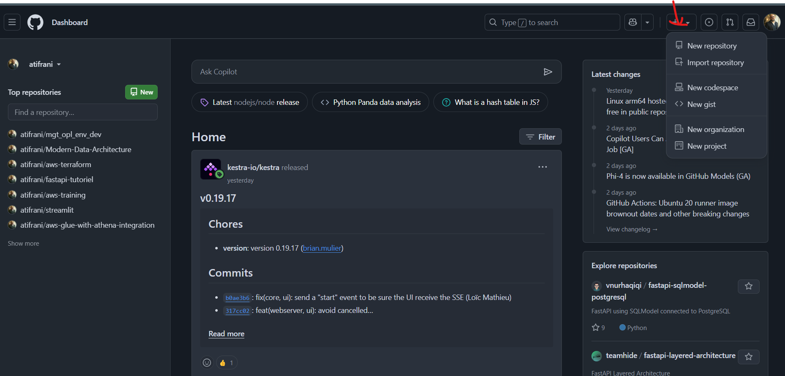
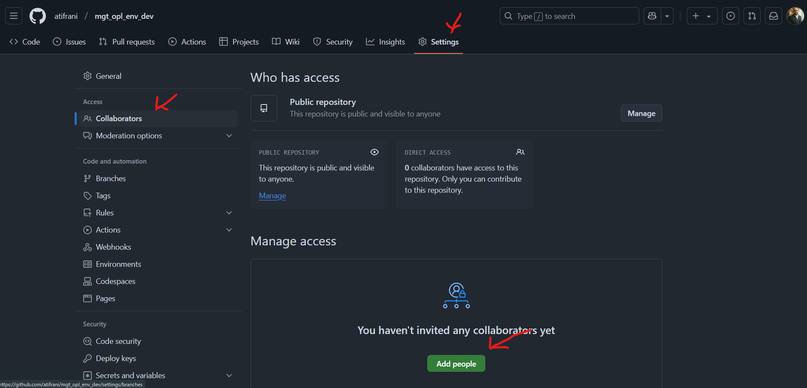
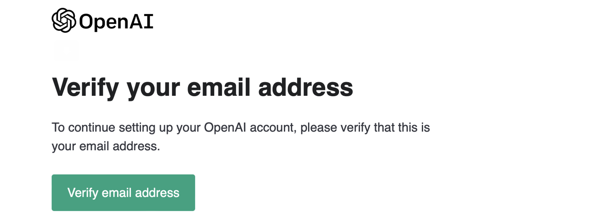
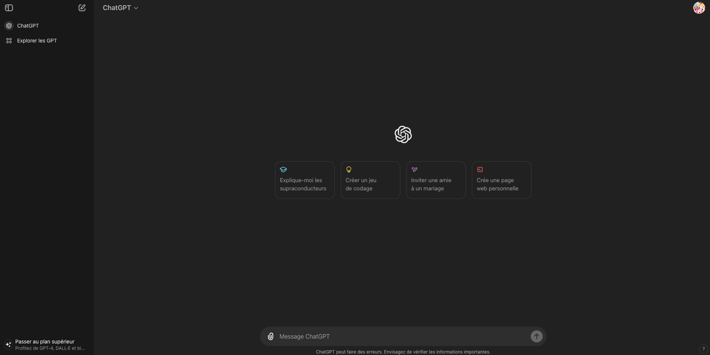
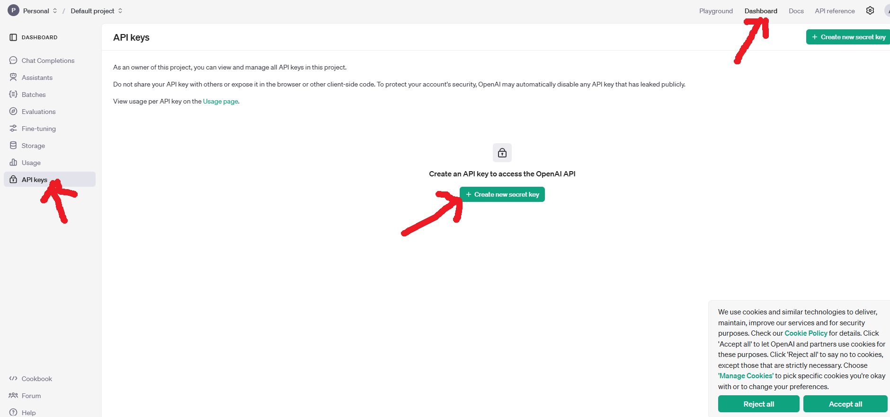

# streamlitbot: Construire un dashboard 

## Introduction:
L'avénement des LLM comme GPT a révolutionné le développement d'application de chatbot.
Streamlit propose plusieurs éléments permettant de créer des interface graphiques pour les chatbots rapidement.

Pour cet atelier, nous allons construire une chatbot basé sur ChatGPT et Streamlit en utlisant simplement du code python.

## Création d'un dépôt github:
Connectez vous sur votre compte github pour créer un nouveau dépôt.

1. Dans le coin supérieur droit de n'importe quelle page, utilisez le menu déroulant et sélectionnez Nouveau dépôt.




2. Saisissez un nom pour votre référentiel **streamlitdash** et une description facultative.

3. Choisissez une visibilité **public** du référentiel.

4. Selectionnez ajouter le fichier **README**.

5. Sélectionnez **Créer un référentiel** et félicitations ! Vous venez de créer un référentiel !

6. Invitez les membres de votre groupe sur le projet git.



Une fois le dépôt créé, copiez le sur votre ordinateur en utilisant la commande **git clone**.

1. Ouvrez **VSCODE** sur votre ordinateur

2. Vérifiez que git est correctement installé sur votre ordinateur avec la commande suivante:

```
git --version
```

Si git n'est pas installé sur votre ordinateur, vous pouvez vous référez au cours sur la partie git https://github.com/atifrani/mgt_opl_env_dev/blob/main/GIT.md.

3. Lancez un terminal et exécutez la commande ci dessous **"il faut mettre à jour ce qui est entre <>"**:

```
git clone <url du dépôt>
```

4. ouvrez le fichier README.MD et ajoutez les noms des membres du groupe:

```
## Groupe:
    * membre 1
    * membre 2
```

5. Réalisez le workflow de base pour enregistrer les modifications dans votre dépôt git.

```
git status
git add .
git commit -m "initial commit"
git status
git push origin main
```

6. Vérifiez que les modifications sont bien sur votre dépôt distant github.

## Création d'un compte openia 'ChatGPT':

**ChatGPT** peut être utilisé gratuitement dans sa version de base. Tout ce que vous avez à faire est de vous créer un compte sur ChatGPT.

Si tout va bien, l'écran vous souhaite la bienvenue et vous propose soit de vous connecter **(Log in)**, soit de créer un compte **(Sign up)** :  


on vous proposera de créer votre compte. Renseignez votre e-mail :


Vous allez ensuite recevoir un e-mail pour valider votre compte:



Une fois que c'est fait, on vous demandera quelques informations : nom, prénom, date de naissance, numéro de téléphone (qu'il faudra valider grâce à un code reçu par SMS).  


Une fois la configuration terminée, vous découvrez l'interface utilisateur de ChatGPT :



## Générer la clé API OpenAI
Une fois que vous avez créé votre compte OpenAI et que vous vous êtes connecté à votre compte sur ce lien **https://platform.openai.com/**, vous verrez les initiales de votre nom et l'icône de votre profil dans le coin supérieur droit du tableau de bord OpenAI. Pour générer une clé API OpenAI, appuyez sur **dashboard** afficher le menu déroulant. Cliquez sur l'option « les clés API » **API keys**.


À ce stade, vous verrez une fenêtre avec l’option « Créer une nouvelle clé secrète » **Create new secret key** près du centre. Cliquez sur cette option pour en obtenir une. Assurez-vous d’enregistrer cette clé API nouvellement générée dès que possible. En effet, vous ne pourrez plus voir la clé API OpenAI complète une fois la fenêtre fermée.  




## Creation d'un virtual environnement:

Verifiez que **Python** est correctement installé sur votre ordinateur, si ce n'est pas le cas vous pouvez suivre la documentation suivante pour installer **Python**.
https://github.com/atifrani/mgt_opl_env_dev/blob/main/STREAMLIT.md

Exécutez cette commande pour verifiez l'installation:

```
python --version

ou 

python3 --version

```

Vérifiez que pip est installé correctement en utilisant les commandes suivantes.

```
pip --version

ou

pip3 --version

```

Pour créer un nouvel environnement virtuel avec Python, saisissez ce qui suit :

Ouvrez un terminale sur vscode et placez vous à l'intérieur du projet:

```
cd streamlitbot
```

Ensuite exécutez la commande suivante pour créer un environnement virtuel:

```
python -m venv stenv

ou 

python3 -m venv stenv
```

Pour utiliser un environnement python que nous venons de créer et qui s'appelle stenv, entrez ce qui suit dans la ligne de commande :

```
source stenv/bin/activate 

ou 

source stenv/Scripts/activate 

```

Créez un fichier **.gitignore** dans votre projet et ajoutez les lignes suivantes et sauvegardez le fichier.

```
# Python venv 
stenv

.gitignore
```

### Installation des bibliothèques python:

* Créez un fichier **requirements.txt** à l'intérieur de votre projet.  
* Ajoutez la bibliothéque **streamlit** dans le fichier **requirements.txt**.  
* Installez la biblionthéque en exécutant le commande suivante:


```
pip install -r requirements.txt
```

Verifiez que **Streamlit** est correctement installé en exécutant la commande suivante:

```
streamlit hello
```

## Creation de mon premier chatbot:

1. Créer une nouvelle **branch** git nommée **version1**

```
git branch version1     # Créer une nouvelle branch

git branch            # vérifier que la nouvelle branch existe

git checkout version1   # se positionner sur la nouvelle branch

```

Créez un fichier **chatbot.py** dans votre projet.

Copiez coller les lignes suivantes dans le fichier **chatbot.py**

```
import streamlit as st

st.title("Echo Bot")

# Initialize chat history
if "messages" not in st.session_state:
    st.session_state.messages = []

# Display chat messages from history on app rerun
for message in st.session_state.messages:
    with st.chat_message(message["role"]):
        st.markdown(message["content"])
```

Verifiez que votre application s'exécute correctement:

```
streamlit run chatbot.py
```

Réalisez le workflow de base pour enregistrer les modifications dans votre dépôt git.

```
git status
git add .
git commit -m "premiere version de mon chatbot"
git status
git push origin version1
```

Fusionner la nouvelle version avec la branch main.

```
git checkout main
git merge version1
```
2. Créer une nouvelle **branch** git nommée **version2**

Copiez et collez les lignes ci-dessous, ajoutez les dans le fichier chatbot.py et sauvegardez.

```
# React to user input
if prompt := st.chat_input("What is up?"):
    # Display user message in chat message container
    with st.chat_message("user"):
        st.markdown(prompt)
    # Add user message to chat history
    st.session_state.messages.append({"role": "user", "content": prompt})
```

* Verifiez que votre application s'exécute correctement.

* Réalisez le workflow de base pour enregistrer les modifications dans votre dépôt git.

* Fusionner la nouvelle version avec la branch main.


3. Créer une nouvelle **branch** git nommée **version3**

Copiez et collez les lignes ci-dessous, ajoutez les dans le fichier chatbot.py et sauvegardez.

```
response = f"{prompt}"
# Display assistant response in chat message container
with st.chat_message("assistant"):
    st.markdown(response)
# Add assistant response to chat history
st.session_state.messages.append({"role": "assistant", "content": response})
```
* Verifiez que votre application s'exécute correctement.

* Réalisez le workflow de base pour enregistrer les modifications dans votre dépôt git.

* Fusionner la nouvelle version avec la branch main.

## Construire un chatbot ChatGPT:

1. créez un nouveu fichier python **chatbotgpt.py** dans le projet **streamlitbot**

2. ouvrez le fichier **requirements.txt** et ajoutez la bibliothéque **openai** dans le fichier, puis relancez l'installation des bibliothéques.

3. Créez un nouveu dossier **.streamlit** dans le projet **streamlitbot**

4. Créez un nouveu fichier **secrets.toml** dans le projet **.streamlit**

5. Copiez collez les lignes de code ci-dessous dans le fichier **secrets.toml**

```
# .streamlit/secrets.toml
OPENAI_API_KEY = "YOUR_API_KEY"
```

Mettez à jour la valeur de "YOUR_API_KEY" avec votre clé Openai et sauvegardez le fichier.

6. Ajoutez le dossier **.streamlit** et le fichier **secrets.toml** au fichier **.gitignore** et sauvegardez le fichier.

7. Réalisez le workflow de base pour enregistrer les modifications dans votre dépôt git.

8. Developpez votre nouveau chatbot.

Nous utiliserons le même code que précédemment, mais nous remplacerons la liste des réponses par un appel à l'API OpenAI. Nous ajouterons également quelques modifications supplémentaires pour rendre l'application plus proche de ChatGPT.

9. Créer une nouvelle **branch** git nommée **version4**

Copiez et collez les lignes ci-dessous, ajoutez les dans le fichier **chatbotgpt.py** et sauvegardez.

```
import streamlit as st
from openai import OpenAI

st.title("ChatGPT-like clone")

# Set OpenAI API key from Streamlit secrets
client = OpenAI(api_key=st.secrets["OPENAI_API_KEY"])

# Set a default model
if "openai_model" not in st.session_state:
    st.session_state["openai_model"] = "gpt-3.5-turbo"

# Initialize chat history
if "messages" not in st.session_state:
    st.session_state.messages = []

# Display chat messages from history on app rerun
for message in st.session_state.messages:
    with st.chat_message(message["role"]):
        st.markdown(message["content"])

# Accept user input
if prompt := st.chat_input("What is up?"):
    # Add user message to chat history
    st.session_state.messages.append({"role": "user", "content": prompt})
    # Display user message in chat message container
    with st.chat_message("user"):
        st.markdown(prompt)
```

* Verifiez que votre application s'exécute correctement.

* Réalisez le workflow de base pour enregistrer les modifications dans votre dépôt git.

* Fusionner la nouvelle version avec la branch main.

La seule chose qui a changé, c'est que nous avons ajouté à st.session_state et défini notre clé API OpenAI à partir des secrets Streamlit.

10. Créer une nouvelle **branch** git nommée **version5**

Copiez et collez les lignes ci-dessous, ajoutez les dans le fichier **chatbotgpt.py** et sauvegardez.

```
 # Display assistant response in chat message container
    with st.chat_message("assistant"):
        stream = client.chat.completions.create(
            model=st.session_state["openai_model"],
            messages=[
                {"role": m["role"], "content": m["content"]}
                for m in st.session_state.messages
            ],
            stream=True,
            max_tokens = 200,
        )
        response = st.write_stream(stream)
    st.session_state.messages.append({"role": "assistant", "content": response})
```

* Verifiez que votre application s'exécute correctement.

* Réalisez le workflow de base pour enregistrer les modifications dans votre dépôt git.

* Fusionner la nouvelle version avec la branch main.

## Ajout de fonctionnalités.
Pour chaque fonctionnalité, il faut créer une nouvelle branch, tester que la fonctionnalité fonctionne et réalisez le workflow de base pour enregistrer les modifications dans votre dépôt git.

1. ajoutez un **selectbox** qui permettra de choisir un type de modéle de GPT.  
La selection doit permettre de choisir une des valeurs suivante:
* gpt-3.5-turbo
* gpt-3.5-turbo-instruct
* gpt-3.5-turbo-1106
* gpt-3.5-turbo-0125

2. ajoutez un **slider** qui permettra de choisir le nombre maximum de jetons  ** variable max_tokens** pouvant être générés dans le modéle de GPT.  
La selection doit permettre de choisir une valeur en 0 et 500. La valeur choisie doit être affecter à la variable **max_tokens** dans le code.


## Livrable:

Le livrable doit être un dépôt github public avec le code des deux applications streamlit et un fichier **README.md** contenant:

1. les noms des membres
2. les commandes à suivres pour récupérer votre code sur un pc et comment l'exécuter.
3. Envoyer le lien de votre projet github sur l'adresse axel@logbrain.fr


